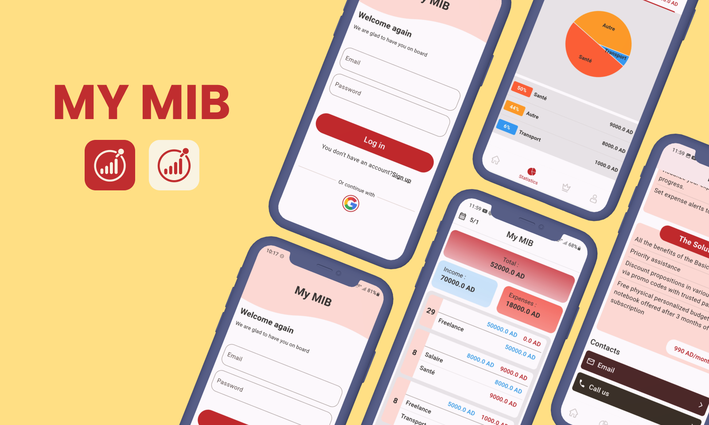
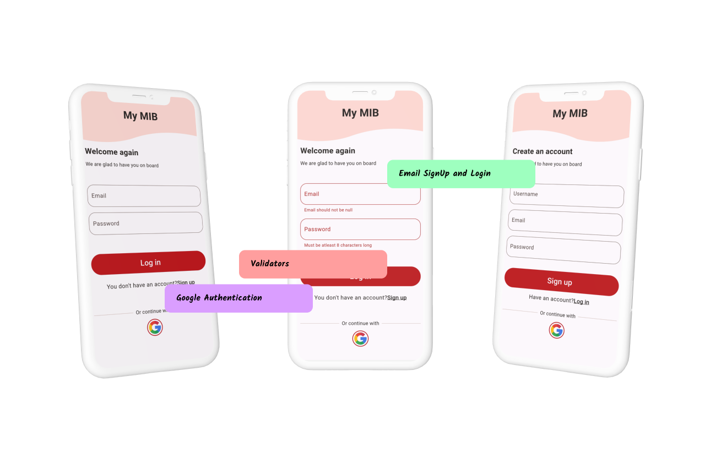
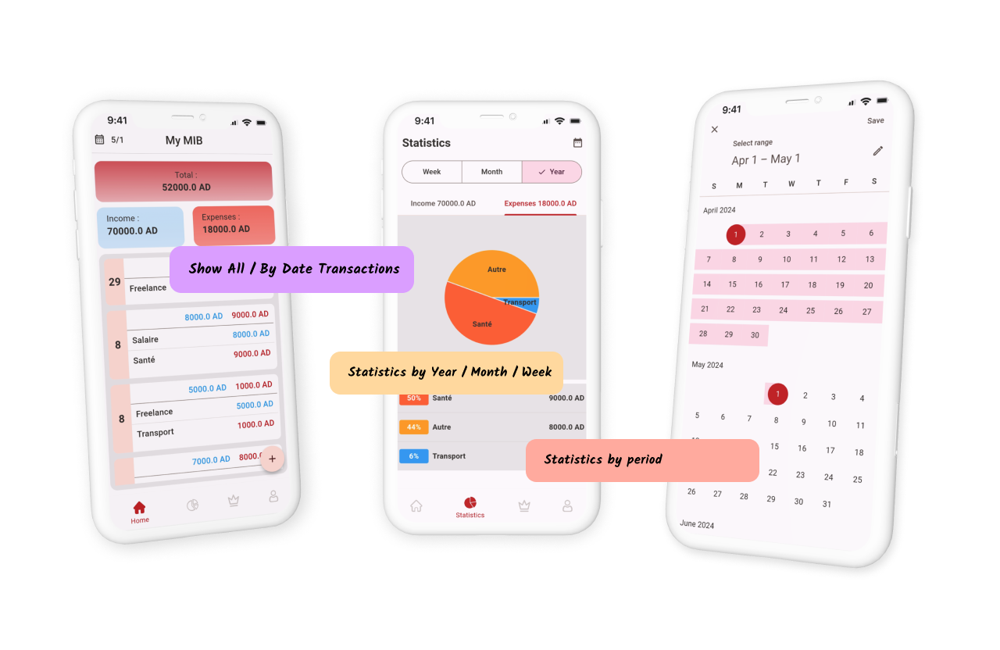
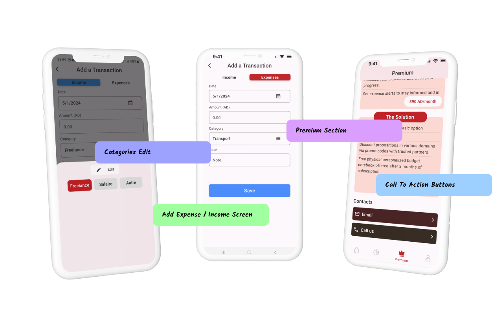

# 💸 MyMib – Advanced Financial Management

**MyMib** is a beautifully crafted, cross-platform financial management application built with **Flutter**.  
It empowers users to effortlessly **track expenses and income**, gain **deep insights** into their spending habits through detailed analytics, and manage their finances in **multiple languages**.  

The app is designed to be **secure, intuitive, and powerful**, offering a seamless experience for personal finance management.

  

---

## ✨ Features

- 💰 **Expense & Income Tracking** – Log transactions in seconds with a clean, user-friendly interface.  
- 🎨 **Customizable Categories** – Create and manage personalized categories with unique icons and colors to organize your finances your way.  
- 📊 **Insightful Analytics** – Visualize your financial habits with beautiful, detailed charts and reports to understand where your money goes.  
- 🌍 **Multi-Language Support** – Fully available in **Arabic, English, and French**, with a seamless language-switching experience.  
- 🔒 **Secure Authentication** – Protect your data with robust login options, including **Google Sign-In** and **email/password**, powered by Firebase Authentication.  
- ⚡ **Offline-First Functionality** – All your data is stored securely on your device using **SQFlite**, allowing the app to work perfectly with or without an internet connection.  
- 🌙 **Light & Dark Themes** – A stunning, modern UI that adapts to your system’s theme for comfortable viewing day or night.  
- ☁️ **Cloud Sync (Optional)** – Keep your data backed up and synced across devices with **Firebase**.  

---

## 📸 App Screenshots

Here are some previews of **MyMib** in action:

  
  
  
  

---

## 🛠️ Tech Stack & Architecture

- **Framework**: Flutter (Dart)  
- **Architecture**: Clean Architecture  
- **State Management**: Bloc  
- **Local Database**: SQFlite  
- **Backend & Auth**: Firebase (Authentication, Firestore for sync)  
- **Authentication**: google_sign_in  
- **Charting / Analytics**: fl_chart  
- **Localization**: flutter_localizations  

---

## 🎯 Project Goal

**MyMib** was created to provide a **comprehensive yet simple tool** for personal financial management.  
The goal was to build an app that not only tracks transactions but also provides **actionable insights**, all while being:  

- 🔒 Secure  
- 🌍 Accessible to a global audience with **multi-language support**  
- 🎨 A pleasure to use with a polished, modern design  

It serves as a **demonstration of building a feature-rich, production-quality app** with **Flutter and Bloc**.

---

## 📬 Contact Me

💡 Have questions, ideas, or want to collaborate? Reach out to me!  

**Elmehdi Elouissi**  
- [Github](https://www.github.com/dadixcod)  
- [LinkedIn](https://www.linkedin.com/in/dadixcod)  

---

👨‍💻 Developed with ❤️ using **Flutter**
